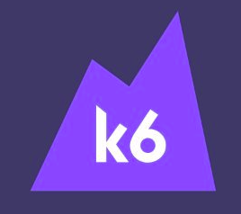

# K6 [Load Testing]



## What is k6?

k6 is a developer-centric, free and open-source load testing tool built for making performance testing a productive and enjoyable experience.

Using k6, you'll be able to catch performance regression and problems earlier, allowing you to build resilient systems and robust applications.

## Installation

### Ubuntu

```jsx
sudo apt-key adv --keyserver hkp://keyserver.ubuntu.com:80 --recv-keys 379CE192D401AB61
echo "deb https://dl.bintray.com/loadimpact/deb stable main" | sudo tee -a /etc/apt/sources.list
sudo apt-get update
sudo apt-get install k6
```

## Mac

```bash
brew install k6
```

## Docker

```docker
docker pull loadimpact/k6
```

## Running K6

Let's start by running a simple local script. Copy the code below, paste it into your favourite editor, and save it as "script.js":

```jsx
import http from 'k6/http';
import { check } from 'k6';

export default function () {
  var data = {
    name: 'name',
  };
  let headers = { transactionid: "load-test-00" };
  var res = http.post('http://localhost:3000/api/user', data, {headers: headers});
  check(res, {
    "response code was 200": (res) => res.status == 200,
  });
}
```

**Then run k6 using this command:**

```bash
k6 run --vus 10 --duration 30s script.js
```

**Here we're running a 30-second, 10-VU(virtual users) load test.**

```bash
data_received..............: 148 MB 2.5 MB/s
data_sent..................: 1.0 MB 17 kB/s
http_req_blocked...........: avg=1.92ms   min=1µs      med=5µs      max=288.73ms p(90)=11µs     p(95)=17µs
http_req_connecting........: avg=1.01ms   min=0s       med=0s       max=166.44ms p(90)=0s       p(95)=0s
http_req_duration..........: avg=143.14ms min=112.87ms med=136.03ms max=1.18s    p(90)=164.2ms  p(95)=177.75ms
http_req_receiving.........: avg=5.53ms   min=49µs     med=2.11ms   max=1.01s    p(90)=9.25ms   p(95)=11.8ms
http_req_sending...........: avg=30.01µs  min=7µs      med=24µs     max=1.89ms   p(90)=48µs     p(95)=63µs
http_req_tls_handshaking...: avg=0s       min=0s       med=0s       max=0s       p(90)=0s       p(95)=0s
http_req_waiting...........: avg=137.57ms min=111.44ms med=132.59ms max=589.4ms  p(90)=159.95ms p(95)=169.41ms
http_reqs..................: 13491  224.848869/s
iteration_duration.........: avg=445.48ms min=413.05ms med=436.36ms max=1.48s    p(90)=464.94ms p(95)=479.66ms
iterations.................: 13410  223.498876/s
vus........................: 100    min=100 max=100
vus_max....................: 100    min=100 max=100
```

**If you want to ramp up and ramp down the tests:**

```jsx
import http from 'k6/http';
import { check, sleep } from 'k6';

export let options = {
  stages: [
    { duration: '30s', target: 20 },
    { duration: '1m30s', target: 10 },
    { duration: '20s', target: 0 },
  ],
};

export default function () {
  let res = http.get('https://httpbin.org/');
  check(res, { 'status was 200': (r) => r.status == 200 });
  sleep(1);
}
```